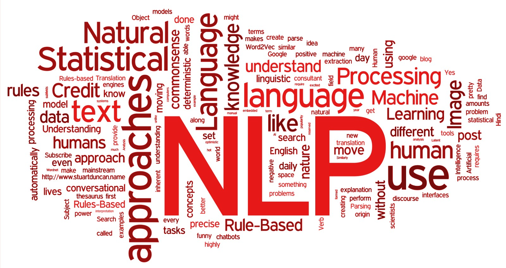
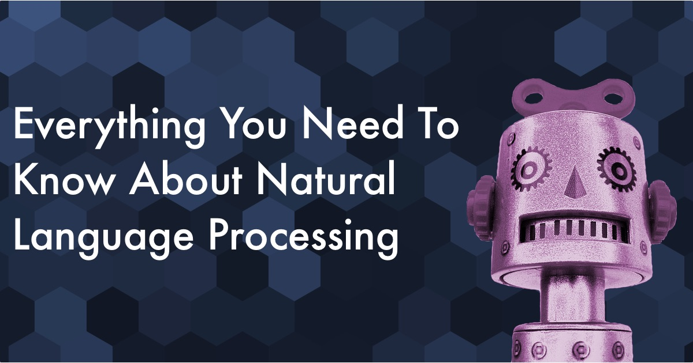

# Natural-Language-Processing End-to-End Implementation Examples

In recent years, natural language processing (NLP) has seen quick growth in quality and usability, and this has helped to drive business adoption of artificial intelligence (AI) solutions. In the last few years, researchers have been applying newer deep learning methods to NLP. Data scientists started moving from traditional methods to state-of-the-art (SOTA) deep neural network (DNN) algorithms which use language models pretrained on large text corpora.

This repository contains the full implementation example of several Natural Language Processing methods in Python, which can be used in any dataset of indutry to readily usage. I tried to output it all as jupyter notebook so that it's easy to read and follow through. 

The goal of this repo is to provide a comprehensive set of tools and examples that leverage recent advances in NLP algorithms.

When properly consumed in order, this will guide you through the basics of NLP concepts and skills through several different libraries (Keras, Tenforfow), and eventually will help build production-level systems like Chatbot / Recommendation system based on the language data 

## Table of contents
* [Requirements](#Requirements)
* [Usage](#Usage)
* [Data](#Data)
* [Implementation](#Implementation)
* [To-do](#ExtraLearning)
* [Refernece](#Refernece)

### Requirements
- Python 3
- Tensorflow 2.x 
- Numpy
- Pandas
- sklearn
- Transformers

### Usage
- Install required packages.
- Follow along each Jupyter Notebooks

### Data
Each dataset needed for each notebook can be downloaded through 'wget'. Also, full dataset can be found in 'data' folder in this repo.

## Implementation

  #### [01_News_Category_Classification](https://github.com/hyunjoonbok/natural-language-processing/blob/master/01_News_Category_Classification.ipynb): 
  We try to classify the category of the News using the pre-trained embedding model. Use Keras to build model from scrath and start training.
  
  #### [02_Sentiment_Analysis_in_Keras](https://github.com/hyunjoonbok/natural-language-processing/blob/master/02_Sentiment_Analysis_in_Keras.ipynb): 
  We perform a sentiment Analysis using Google BERT model on the movie data with TF Keras API. We use Keras API this time to do the analysis, as Pytorch version examples are already a lot. Also, We will use Korean Movie Review dataset, as analysis done in English Movie Review (IMDB) are easy-to-be-find online. You should be able to have a firm grasp of how Google's language model 'BERT' works, and fine-tune it to apply to any of custom business problems. 

  #### [03_Sentiment_Analysis_in_Tensorflow](https://github.com/hyunjoonbok/natural-language-processing/blob/master/03_Sentiment_Analysis_in_Tensorflow.ipynb): 
  Same sentiment Analysis using Google BERT model on the movie data with Tensorflow 2.0. Here we utilize transformers 'BertTokenizer' and 'BertModel' to easily load functions necessary in BERT, and use it in training. 
  
  #### [04_SQuAD_in_Keras](https://github.com/hyunjoonbok/natural-language-processing/blob/master/04_SQuAD_in_Keras.ipynb): 
  Build SQuAD model using Keras and BERT. Stanford Question Answering Dataset (SQuAD) is a reading comprehension dataset, consisting of questions posed by crowdworkers on a set of Wikipedia articles, where the answer to every question is a segment of text, or span, from the corresponding reading passage, or the question might be unanswerable.   
  
  #### [05_SQuAD_in_Tensorflow](https://github.com/hyunjoonbok/natural-language-processing/blob/master/05_SQuAD_in_Tensorflow.ipynb): 
  This time, we are going to solve the same SQuAD problem with Tensorflow by fine-tuning pretrained BERT-Large model  
  
  #### [06_Named_Entity_Recognition_in_Tensorflow](https://github.com/hyunjoonbok/natural-language-processing/blob/master/06_Named_Entity_Recognition_(NER)_in_Tensorflow.ipynb):
  Solve the another application of Natural Language Processing - Names Entity Recognition (NER). Named entity recognition (NER) ‒ also called entity identification or entity extraction ‒ is an information extraction technique that automatically identifies named entities in a text and classifies them into predefined categories.
  
  #### [07_End-to-End_Speech_Recognition_in_Tensorflow](https://github.com/hyunjoonbok/lets_learn_new_skills/blob/master/End-to-End%20Speech%20Recognition%20in%20Tensorflow.ipynb):
  Build a simpel End-to-End Speech-to-Text model using librosa library. The model takes recordings of 10 different classes or words (data from Kaggle Speech Recognition Challenge), trains algorithm that is in Convolutional 1D, and predicts the sound in text.
  
  #### [08_Generate_fluent_English_text_using_GPT2](https://github.com/hyunjoonbok/lets_learn_new_skills/blob/master/Generate%20fluent%20English%20text%20using%20transformers%20GPT2.ipynb):
  A simple example to look at different decoder method provided by Transformer library. We use GPT2 specifically to to see which decoder gerenates the most human-like languages when given texts.
  

## ExtraLearning 
1. Novel generator using KoGPT2 and pytorch [Link](https://github.com/shbictai/narrativeKoGPT2?fbclid=IwAR1sRXEtzaVYPB5Ez3txT4M1DXZs3sQ24kYWKaXR3QDY-6gkr2xL18kD3g4)
2. Text GEneration / Lyric GEneration / SQuAD fine-tuning [Link](https://github.com/MrBananaHuman/KorGPT2Tutorial)
3. Make a simple Chat-bot in Korean language using Korean language data and pre-trained KoGPT2 model [Link](https://github.com/haven-jeon/KoGPT2-chatbot)

### Refernece
> https://github.com/kimwoonggon/publicservant_AI \
> https://github.com/microsoft/nlp-recipes \
> https://github.com/NirantK/nlp-python-deep-learning \
> https://github.com/monologg/KoBERT-NER \
